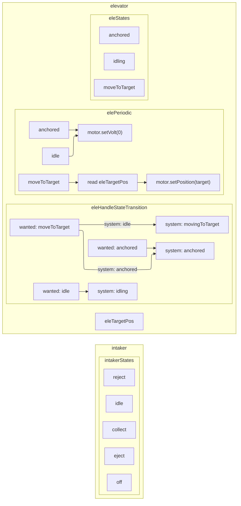

If you can't see the graph below install markdown preview mermaid extension (vscode) or markdown plugin and mermaid plugins (idea)

```mermaid
---
config:
    layout: elk
---
flowchart LR

subgraph intaker
    subgraph intakerStates
        isti[idle]
        istc[collect]
        istr[reject]
        iste[eject]
        isto[off]
    end
end

subgraph elevator

    subgraph eleStates
        esti["idling"]
        estm[moveToTarget]
        esta["anchored"]
    end

    eleTargetPos

    subgraph eleHandleStateTransition
        ewi[wanted: idle] --> esi[system: idling]
        ewm[wanted: moveToTarget] --"system: idle"-->esm[system: movingToTarget]
        ewm --"system: anchored"--> esa[system: anchored]
        ewa[wanted: anchored] --> esa
    end

    subgraph elePeriodic
        epm[moveToTarget] --> ehr["read eleTargetPos"]--> esetm["motor.setPosition(target)"]
        epi[idle] --> estopm["motor.setVolt(0)"]
        epa[anchored] --> estopm
    end

end
```